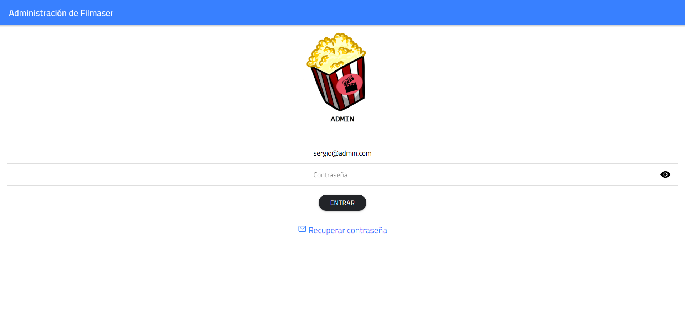
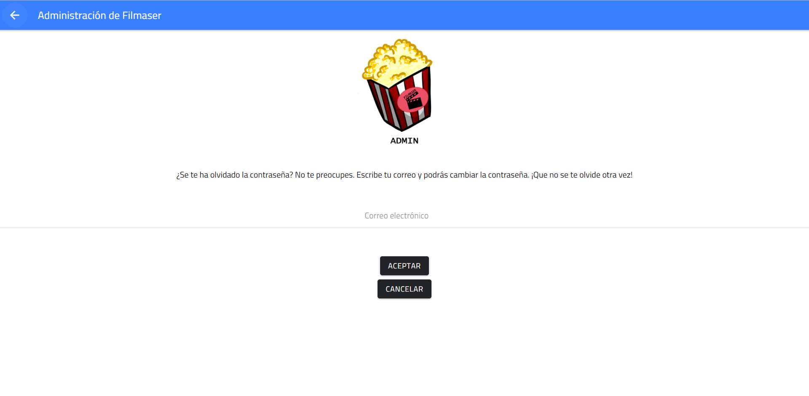
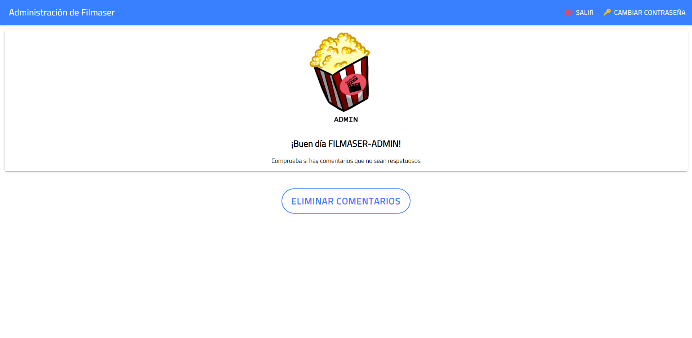
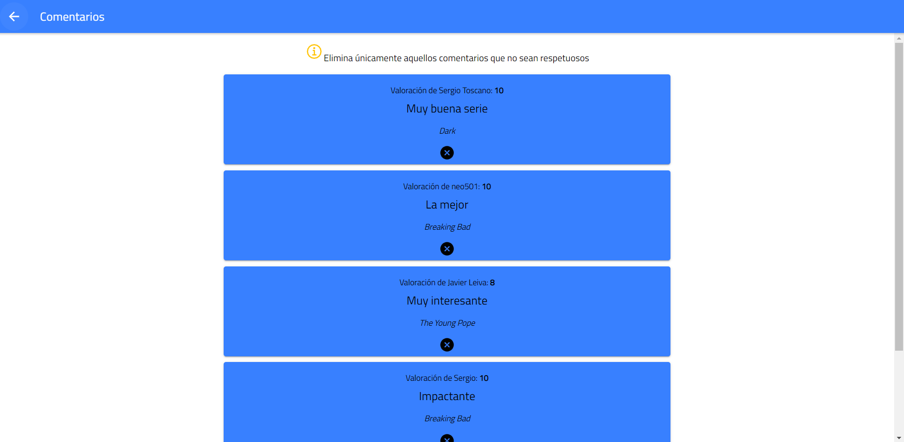

<h1> Filmaser-Admin </h1>

Proyecto final de la app Filmaser en Ionic para el Grado Superior de Desarrollo de Aplicaciones Multiplataforma del IES Campanillas.

<h3> Tutorial de uso de Filmaser-Admin </h3>

<h4> Login </h4>

Lo primero que se ve en la aplicación es la pantalla de Login con el correo bloqueado, ya que Filmaser cuenta con un administrador en su inicio:

<h4> Reset </h4>

El administrador puede solicitar recuperar la contraseña en caso de olvido:

<h4> Página principal </h4>

Esta es la vista de la página principal. Filmaser-Admin cuenta con una acción de Eliminar Comentarios:

<h4> Eliminar comentarios </h4>

En esta página se puede eliminar los comentarios que no sean respetuosos:

