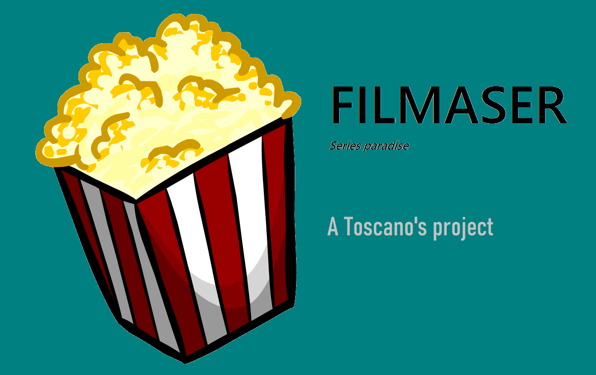
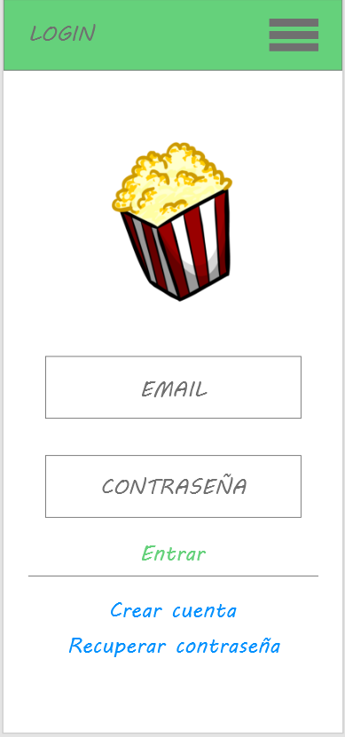
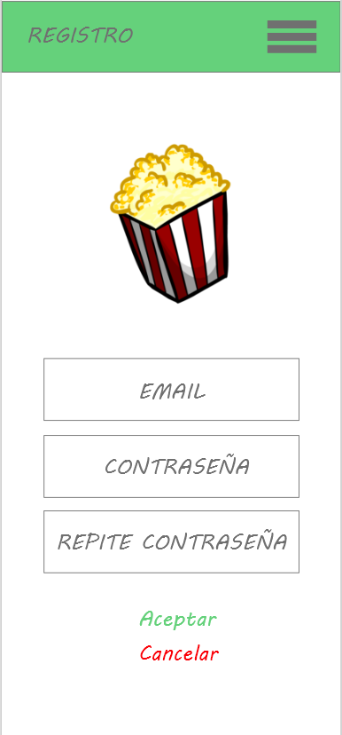
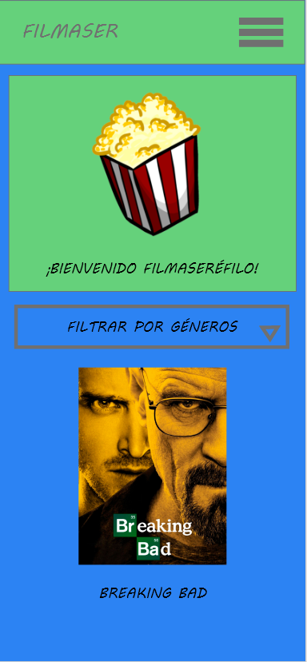
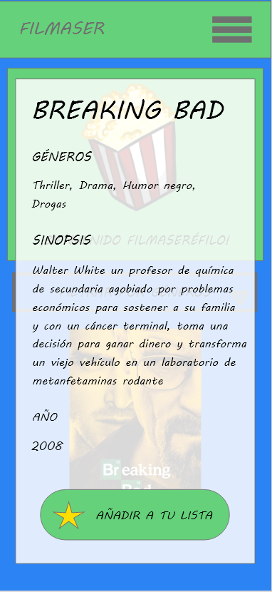
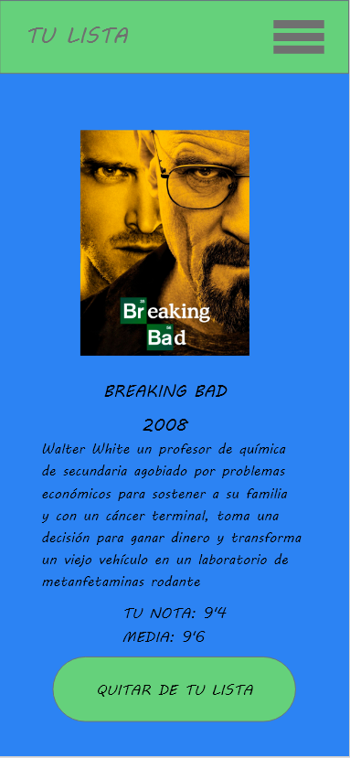

<h1> Filmaser </h1>

Proyecto final de la app Filmaser en Ionic para el Grado Superior de Desarrollo de Aplicaciones Multiplataforma del IES Campanillas.

<h3> Descripción </h3>

Los usuarios de Filmaser podrán añadir las series que les gusten a una lista de favoritos, de seguimiento, de finalizadas o de pendientes. Además, podrá comentar aquellas que haya terminado.

<h3> Objetivos </h3>

Filmaser es una aplicación orientada a aquellas personas que les gusten ver series y quieran tener a su disposición una lista de las que están viendo. 

<h3> Funcionalidades </h3>

Cuando el usuario inicie sesión con su cuenta o se registre, accederá a la página principal de la aplicación. Allí podrá ver una lista de series y filtrar según el género que quiera para no ver todas las series. Aquellas series que al usuario le gusten, podrá añadirlas a una lista de seguimiento o pendientes, en la lista de seguimiento añadirlas a favoritos o vistas y en la de pendientes sólo seguirlas. Cabe destacar que cada serie tiene información como el/los género/s, sinopsis y año. Otra funcionalidad en la que se trabajará será que las series que el usuario ha añadido a su lista se puedan comentar. 
La aplicación contendrá una página en la que se podrá ver una breve descripción y mi github. 

En cuanto a la parte de administración, el administrador de la aplicación podrá añadir, modificar o eliminar series.

En el mockup de abajo se pueden ver las funcionalidades principales que tendrá Filmaser. 

<h3> ¿Qué se usará? </h3>

- Visual Studio Code para la realización de la aplicación.
- Firebase para administrar la base de datos.
- Angular.
- Ionic.
- Git.

<h3> Histórico semanal </h3>

<h5> SEMANA 1: 19/04 - 25/04 </h5>

- Creación del proyecto ionic desde cero.
- Modificación del logo en Inkscape.
- Creación del proyecto en Firebase, configuración en local y creación de la base de datos.
- Se ha creado una clase llamada Serie que alberga los campos necesarios.
- Además, se han hecho páginas como la principal, la lista de favoritos o el login y el componente menú.
- Se ha implementado dos servicios en la aplicación uno para la autenticación a la aplicación gracias a Firebase y otro para añadir series a una lista.

<h5> SEMANA 2: 26/04 - 2/05 </h5>

- Creación de la página de series pendientes, seguidas y vistas.
- Las nuevas listas se han añadido al componente del menú.
- Se ha implementado las guardas de las rutas en las nuevas páginas creadas para no poder acceder a ellas si no estás logueado.
- Uso de la ventana modal para acceder a los distintos botones de las listas.
- Se ha añadido el logo a la aplicación.
- Refactorización de algunas partes de la aplicación.

<h5> SEMANA 3: 3/05 - 9/05 </h5>

- Modificación de algunas partes del la aplicación.
- Limpieza de código.
- Creación de una nueva clase para probar una funcionalidad nueva.
- Comenzando a implementar los comentarios para las series vistas.
- Uso del Storage para recordar el último email usado en el login de Filmaser.
- Investigando para mejorar la aplicación.

<h5> Día 13/05 antes del checkpoint </h5>

- Código actualizado con lo  que se ha avanzado esta semana.
- APK generada.
- Hosting de Firebase: https://filmaser-app.web.app/login
- Bibliografía actualizada.
- Vídeo explicativo Checkpoint: https://www.youtube.com/watch?v=OITGQ7hUGYU.

<h5> SEMANA 4: 10/05 - 16/05 </h5>

- Creación de la página de comentarios y de miscomentarios.
- Implementación de un servicio nuevo para la parte de los comentarios.
- Página modal para añadir comentarios.
- Cambios en la aparencia de la aplicación.
- Generación de la primera APK para el checkpoint de esta semana.
- Modificación de código.

<h5> SEMANA 5: 17/05 - 23/05 </h5>

- Añadidos nuevos métodos para añadir, editar y borrar comentarios.
- Terminada parte de miscomentarios.
- Añadido botón de miscomentarios en la lista de botones.
- Solucionados errores de la aplicación.
- Incluido un nuevo botón para la parte de información.
- Investigando cómo empezar con la parte del administrador.

<h5> SEMANA 6: 24/05 - 30/05 </h5>

- Próximo día 30/05 actualización.

<h3> Bibliografía </h3>

Por ahora he usado estas páginas para la realización de la aplicación:
- [Ionic Framework](https://ionicframework.com/docs)
- [Firebase](https://firebase.google.com/)
- [IonIcons](https://ionic.io/ionicons)

<h3> Mockup </h3>

Esta es una idea principal de la aplicación. Es probable que se cambien algunos aspectos en la aplicación final.

# Login

# Registro

# Principal

# Serie

# Lista

No olvides de dejar una estrellita si te ha gustado el repositorio :)
